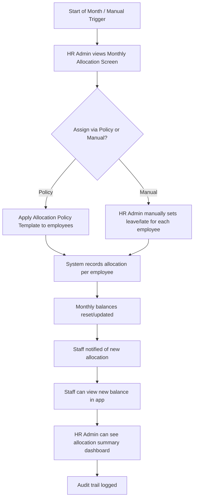
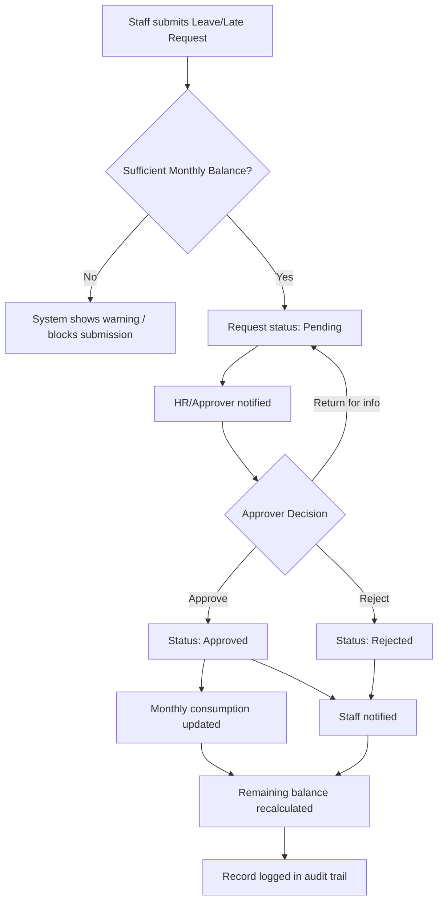
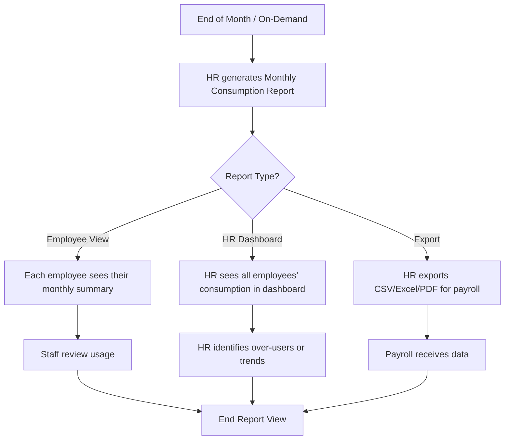

# Product Requirements Document (PRD)
## Leave & Late Request Management System

**Document Version:** 1.0
**Status:** Draft
**Owner:** HR Department

---

## 1. Overview

### 1.1 Purpose
The organization currently manages staff leave applications and late-arrival requests manually (paper forms, email, or spreadsheets). This creates delays, poor visibility, and inconsistent record-keeping. This document defines the requirements for a **Leave & Late Request Management System** that lets staff submit requests digitally and lets HR review, approve, or reject them through a single platform.

### 1.2 Problem Statement
- Staff have no self-service way to apply for leave or report lateness.
- HR has no centralized dashboard to track pending, approved, or rejected requests.
- There is no audit trail of who approved what, and when.
- Leave balances are tracked manually, leading to errors and disputes.

### 1.3 Goals
- Provide staff a simple way to submit leave and late requests from web/mobile.
- Give HR a single dashboard to review, approve, or reject requests with comments.
- Automatically track and update leave balances.
- Maintain a full audit trail and generate reports for compliance and payroll.
- Notify staff and HR automatically at each step of the workflow.

### 1.4 Non-Goals (Out of Scope for v1)
- Payroll processing or salary deduction calculations.
- Shift scheduling / rostering.
- Biometric/attendance hardware integration (may be considered in a future phase).

---

## 2. Users & Roles

| Role | Description |
|---|---|
| **Staff (Employee)** | Submits leave applications and late requests, views own request history and leave balance. |
| **HR / Approver (Manager)** | Reviews, approves, or rejects requests; can view team/department requests and reports. |
| **HR Admin** | Configures leave types, policies, holidays, approval workflows, and manages user accounts. |
| **System Admin** | Manages user roles, integrations, and system settings (may overlap with HR Admin). |

---

## 3. Mobile-First Design Approach

**This system is primarily designed for mobile use** (90%+ of users will access via mobile devices: smartphones and tablets).

### 3.1 Mobile Design Principles
- **Bottom Navigation Tabs:** Primary navigation at bottom of screen (Home, Apply, My Requests, Notifications, Profile) — easy to reach with thumb.
- **One-Tap Actions:** All major actions (apply leave, approve request, view balance) achievable in 1-2 taps maximum.
- **Large Touch Targets:** All buttons and clickable elements ≥44x44px for comfortable mobile use.
- **Minimal Scrolling:** Content prioritized above-the-fold; pagination for lists rather than infinite scroll.
- **Mobile-Optimized Forms:** Single-column layouts, large input fields, native date/time pickers, auto-fill where possible.
- **Push Notifications:** Real-time alerts for request approvals/rejections; badge count on notification icon.
- **Offline Capability:** Users can view request history, drafts, and leave balance without internet; sync when reconnected.
- **Mobile Charts & Data:** Simplified visualizations; horizontal scroll for wide tables; pie/progress charts for quick insights.
- **Performance:** All pages load under 2 seconds on 4G mobile networks; minimal data usage.
- **Accessibility:** High contrast text, readable fonts (min 16px), proper spacing for older users.
- **Portrait-First:** Optimized for portrait orientation; landscape support as nice-to-have.

### 3.2 Desktop (Web) is Secondary
- Full responsive design for laptops/tablets, but not primary focus.
- Advanced HR analytics, bulk operations, and admin settings can be desktop-only if needed.
- Desktop users can access the same mobile app via web or use a progressive web app (PWA).

### 3.3 Key Mobile Screens (See Wireframes Section Below)
1. **Staff Home:** Balance overview, quick-apply buttons, pending requests count.
2. **Apply Leave/Late:** Simple multi-step forms (type → dates → reason → submit).
3. **My Requests:** Timeline of submitted requests with status and action buttons.
4. **Notifications:** Bell icon with unread count; tap to see approval/rejection messages.
5. **Monthly Balance:** Card-based view showing allotted vs. used (leave + late).
6. **HR Dashboard (Mobile):** Simplified view of pending approvals, team consumption summary.
7. **Detailed Request View:** Full details, approval controls, comment section.

---

## 4. User Stories

### Staff
1. As a staff member, I want to apply for leave (with type, dates, reason) so that HR can review and approve it.
2. As a staff member, I want to submit a late-arrival request (with expected time and reason) so my lateness is officially recorded and approved.
3. As a staff member, I want to see my remaining leave balance before applying.
4. As a staff member, I want to see the status (pending/approved/rejected) of my requests.
5. As a staff member, I want to receive a notification when my request is approved or rejected.
6. As a staff member, I want to cancel or edit a pending request before it's approved.
7. As a staff member, I want to attach supporting documents (e.g., medical certificate) to my request.
8. As a staff member, I want to view my monthly leave/late consumption summary to understand how much I've used each month.

### HR / Approver
9. As an HR approver, I want to see all pending requests in one dashboard so I can act on them quickly.
10. As an HR approver, I want to approve or reject a request with an optional comment.
11. As an HR approver, I want to see an employee's leave history and balance before deciding.
12. As an HR approver, I want to receive a notification when a new request is submitted.
13. As an HR approver, I want to set up multi-level approval (e.g., manager then HR) if required.
14. As an HR approver, I want to view how much leave/late each team member has used in a given month.

### HR Admin
15. As an HR admin, I want to configure leave types (annual, sick, unpaid, etc.) and their entitlement rules.
16. As an HR admin, I want to configure public holidays and blackout dates.
17. As an HR admin, I want to manage staff accounts, departments, and reporting lines.
18. As an HR admin, I want to set late-request rules (e.g., max grace period, auto-flag repeated lateness).
19. As an HR admin, I want to allot/assign monthly leave days and late allowances to each employee (either manually or via a policy template).
20. As an HR admin, I want to view a dashboard showing all employees' monthly leave/late consumption for audit and compliance.
21. As an HR admin, I want to set monthly resets or custom allocation periods for leave and late balances.
22. As an HR admin, I want to run monthly reports showing each employee's leave taken, late hours/count, and remaining balance.

---

## 4. Functional Requirements

### 4.1 Leave Application
- FR1: Staff can select a leave type (Annual, Sick, Unpaid, Emergency, Maternity/Paternity, etc.).
- FR2: Staff can select start date, end date, and half-day/full-day option.
- FR3: System auto-calculates number of days requested (excluding weekends/holidays, configurable).
- FR4: Staff can add a reason/notes and attach a file (e.g., medical certificate).
- FR5: System validates against available leave balance and warns if insufficient.
- FR6: Staff can save a draft, submit, or cancel a pending request.
- FR7: Staff can edit or withdraw a request only while it is still pending.

### 4.2 Late Request
- FR8: Staff can submit a late-arrival request with expected/actual arrival time and reason.
- FR9: System timestamps the submission and flags if submitted after a configurable cutoff (e.g., request must be made before/within X minutes of shift start).
- FR10: Repeated late requests within a period can be auto-flagged for HR attention.

### 4.3 Approval Workflow
- FR11: HR/Approver dashboard lists all pending requests with employee name, type, dates, and reason.
- FR12: Approver can approve, reject, or return a request with comments.
- FR13: System supports configurable single-level or multi-level approval chains.
- FR14: On approval, leave balance is automatically deducted; on rejection, no deduction occurs.
- FR15: All actions (submit, approve, reject, edit, cancel) are logged with timestamp and user for audit purposes.

### 4.4 Notifications
- FR16: Email/in-app notification to HR when a new request is submitted.
- FR17: Email/in-app notification to staff when their request status changes.
- FR18: Optional reminder notifications for requests pending beyond a set duration.

### 4.5 Leave Balance & Calendar
- FR19: Each staff member has a leave balance dashboard by leave type.
- FR20: A shared team/department calendar view shows approved leave and late records (for planning purposes).
- FR21: Public holidays and weekends are excluded automatically from leave-day calculations (configurable).

### 4.6 Monthly Allocation & Entitlement
- FR22: HR Admin can assign monthly leave and late allowances to individual employees or via bulk upload (CSV/template).
- FR23: HR Admin can set per-employee monthly allocations (e.g., Employee A gets 2 days, Employee B gets 1.5 days per month).
- FR24: HR Admin can define allocation policies (e.g., "Standard" = 2 leave days + 3 late hours per month; "Senior" = 3 days + 2 hours, etc.).
- FR25: System auto-resets monthly allocations on a configured date (e.g., 1st of each month) or allows manual monthly reset.
- FR26: HR Admin can override/adjust an employee's monthly allocation (e.g., increase for new joiners, decrease for disciplinary reasons).
- FR27: Staff can view their current month's allocation and consumption in real-time.

### 4.7 Monthly Consumption Tracking & Dashboard
- FR28: HR has a dashboard showing, for each employee, the current month's:
  - Leave days allotted vs. taken vs. remaining (by leave type).
  - Late hours/count allotted vs. used vs. remaining.
  - Summary of all requests (approved, pending, rejected) this month.
- FR29: HR can filter the consumption dashboard by employee, department, or custom date range.
- FR30: Monthly report can be exported (CSV/Excel/PDF) showing all employees' consumption summary for payroll/compliance.
- FR31: System can flag employees who have exceeded their monthly allowance (over-used leave/late) for HR action.

### 4.8 Reporting & Audit
- FR32: HR can generate and export reports (CSV/Excel/PDF):
  - Monthly consumption by employee/department (leave taken, late used, remaining).
  - Year-to-date totals.
  - Pending vs approved vs rejected request counts.
  - Employee-wise lateness trends (repeated late submissions).
- FR33: Full audit trail is retained and viewable per request, including who approved, when, and what was the balance at approval time.

### 4.9 Administration
- FR34: HR Admin can configure leave types, entitlement rules, and accrual policies.
- FR35: HR Admin can manage employees, departments, and reporting/approval hierarchy.
- FR36: HR Admin can configure holidays and late-request rules.
- FR37: HR Admin can manage monthly allocation policies and assign them to employee groups.
- FR38: Role-based access control (Staff / Approver / HR Admin).

---

## 5. Non-Functional Requirements

| Category | Requirement |
|---|---|
| **Usability** | Simple, mobile-responsive UI; request submission in under 3 clicks/taps. |
| **Performance** | Dashboard and lists load within 2 seconds under normal load. |
| **Availability** | 99.5%+ uptime during business hours. |
| **Security** | Role-based access control; data encrypted in transit (HTTPS) and at rest. |
| **Auditability** | All approval actions logged and immutable. |
| **Scalability** | Support current headcount with room to scale to 3–5x staff size. |
| **Compliance** | Align with local labor law record-keeping requirements (configurable per region). |
| **Accessibility** | Meet basic accessibility standards (WCAG 2.1 AA where feasible). |

---

## 5.1 HR Admin Dashboard – Monthly Allocation & Consumption (New Section)

The HR Admin Dashboard provides centralized control for allocating and tracking monthly leave/late usage:

**Monthly Allocation Panel:**
- View all employees with their current allocation (leave days + late allowance) for the current month.
- Quick-assign allocations: select employees → pick a policy → apply.
- Manual override: adjust individual employee allocations (e.g., new joiner, leave of absence).
- Bulk upload: import CSV with employee IDs and monthly allocations.
- Set allocation reset date (e.g., 1st of each month) and auto-apply policies.
- Audit history: see who allocated what and when.

**Monthly Consumption Dashboard:**
- Summary view: all employees listed with columns for:
  - Leave days allotted / taken / remaining.
  - Late hours/count allotted / used / remaining.
  - % utilization (e.g., 4/8 days = 50%).
  - Approval status (pending/approved/rejected count this month).
- Drill-down: click an employee to see detailed request log for the month.
- Filters: by department, team, allocation policy, or utilization threshold.
- Alerts: highlight employees who have over-used their allocation or are approaching limits.
- Export: download monthly consumption data for payroll/compliance (CSV, Excel, PDF).

**Monthly Reset / Allocation Rules:**
- Configure automatic monthly reset (date, which leave types reset, carryover rules).
- One-time bulk allocation for a specific month (e.g., end-of-year bonus days).
- Suspension rules (e.g., suspend leave during critical project periods).

---

## 6. Core Workflows

### 6.1 Monthly Allocation Workflow

### 6.2 Request Approval & Consumption Workflow

### 6.3 Monthly Reporting & Review

---

## 7. Data Model (High Level)

**User**
- id, name, email, department, role, manager/approver_id, allocation_policy_id

**LeaveType**
- id, name (Annual/Sick/Unpaid/...), default_entitlement, accrual_rule

**AllocationPolicy**
- id, policy_name (e.g., "Standard", "Senior"), description
- leave_type_id, monthly_leave_days
- monthly_late_hours, monthly_late_count

**MonthlyAllocation**
- id, user_id, year, month, leave_type_id
- allotted_days, taken_days, remaining_days
- updated_at, allocated_by (HR admin who set this)

**MonthlyLateAllocation**
- id, user_id, year, month
- allotted_hours, allotted_count, used_hours, used_count, remaining_hours, remaining_count
- updated_at, allocated_by

**LeaveBalance** (Annual/Lifetime tracking, if applicable)
- user_id, leave_type_id, entitled_days, used_days_ytd, remaining_days, year

**LeaveRequest**
- id, user_id, leave_type_id, start_date, end_date, half_day_flag, reason, attachment, status, submitted_at
- approved_by, approval_date, balance_at_approval

**LateRequest**
- id, user_id, date, expected_time, actual_time, reason, status, submitted_at
- late_duration_hours/minutes, approved_by, approval_date

**ApprovalLog**
- id, request_id (leave or late), approver_id, action (approve/reject/return), comment, timestamp
- balance_before, balance_after (for audit trail)

**Holiday**
- id, date, name, region

**AuditTrail**
- id, action_type (allocation_set, allocation_reset, request_approved, request_rejected), user_id, actor_id (who performed), timestamp, details (JSON)

---

## 8. Success Metrics

- % reduction in time-to-approval (target: under 24 hours average).
- % of requests submitted digitally vs. manual/paper (target: 100% within 3 months of launch).
- Reduction in leave-balance disputes/errors (target: zero disputes by month 2).
- HR time saved per week on leave administration (target: 80% reduction in manual tracking).
- User adoption rate (active staff using the system / total staff) (target: 95%+).
- Accuracy of monthly allocation assignment (target: 100% of allocations applied correctly).
- Monthly report generation time (target: < 5 minutes vs. current manual process).
- Visibility: % of over-users (exceeding monthly allocation) flagged automatically (target: 100%).

---

## 9. Assumptions & Constraints

- All staff have access to a company email and a computer/smartphone.
- Existing employee/department data can be imported (CSV or HRIS integration if available).
- Approval hierarchy (who approves whom) is known and configurable at launch.
- Public holiday calendar is available and maintained by HR Admin.

---

## 10. Future Considerations (Phase 2+)

- Integration with payroll systems.
- Biometric/attendance device integration for automatic late detection.
- Mobile app (native iOS/Android) in addition to responsive web.
- Slack/Teams bot integration for quick approvals.
- Advanced analytics (attrition correlation, absenteeism trends).

---

## 11. Open Questions

**General:**
- What leave types and entitlement policies apply in this organization?
- Is a single-level or multi-level approval required (e.g., team lead → HR)?
- Should there be integration with an existing HRIS/payroll system?
- What is the acceptable grace period before a "late" is auto-flagged?
- Is there a need for multi-location/multi-timezone support?

**Monthly Allocation & Consumption:**
- How much leave and late allowance should each employee get per month? (e.g., 2 days leave + 3 late hours)
- Do different roles/departments have different monthly allocations?
- When should the monthly reset happen? (e.g., 1st of each month, or pay cycle date)
- Should unused allocation rollover to the next month, or does it reset to zero?
- How should new joiners be allocated on their joining mid-month?
- Should there be a maximum limit on how much an employee can over-use (go negative)?
- Who is responsible for manually adjusting allocations (HR Manager, Department Head)?
- How frequently will HR run consumption reports? (weekly, monthly, on-demand)
- Should over-users be flagged for disciplinary action or just reported?